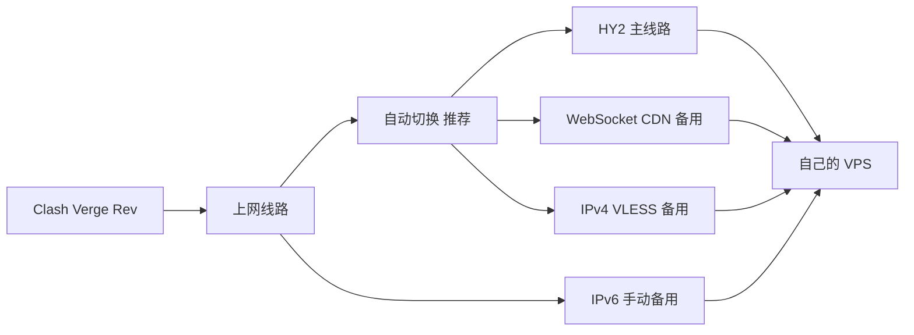

# VPS 自建代理指南：Hysteria2 + VLESS + Clash Verge Rev

[简体中文](README.md) · [English](i18n/README.en.md) · [日本語](i18n/README.ja.md) · [한국어](i18n/README.ko.md) · [Español](i18n/README.es.md) · [Français](i18n/README.fr.md)

一份自建 VPS 代理教程，涵盖服务器选择、部署、Clash Verge Rev 配置与排障。让你的 AI Agent 先阅读 [README.md](README.md) 和 [AGENTS.md](AGENTS.md)，再根据你的网络条件与服务器情况，分阶段引导搭建和验证。

仓库仅提供示例配置，需要使用你自己的服务器和账号。

Self-hosted proxy deployment guide for AI agents: VPS selection, Hysteria2, VLESS, IPv6, CDN fallback and Clash Verge Rev. Includes credential-free templates and repeatable checks.

> 状态：新版完成离线验证；新 VPS 端到端部署尚未复现。本仓库由脱敏文件建立全新历史，发布记录见 [发布状态](docs/release-status.md)。不承诺一键成功或复制他人的网速。

## 我使用的 VPS 服务商

我这套配置用的是 RackNerd。你可以照着这份教程，按自己的预算和网络情况选服务器。

**[查看 RackNerd，支持我继续维护这份教程](https://my.racknerd.com/aff.php?aff=21220)**

*如果你通过这个链接购买，我可能会获得佣金，用来维护和更新这份教程。谢谢支持！*

## 适合谁

希望使用自己服务器的个人开发者、家庭用户，以及需要让 Agent 协助部署的读者。你需要自己的 VPS/域名、SSH 管理权限和客户端。软件模板可复用，服务器和域名费用由使用者自行承担。

## 五分钟开始

1. **先注册账号**：通过上方 RackNerd 支持链接进入网站，注册并登录自己的账号。已有账号直接登录；已有可用 VPS 可跳过选购。
2. **购买前交给 Agent**：把仓库文件夹和下面的任务发给 Agent，结合 [参数表](docs/parameters.example.md) 核对预算、运营商、设备条件与候选套餐。
3. **确认后再购买**：由你核对总价、续费和退款条款，确认付款；等待 VPS 开通并验证 SSH 登录。
4. 按 [部署指南](docs/deployment.md) 逐阶段部署，再按 [验收与恢复](docs/verification.md) 验证。

> 先读 AGENTS.md、README.md 和 docs/。使用我自己的服务器与账号，先询问预算和网络条件、协助选购并核对官方条款；我确认购买且服务器开通后，先搭通 HY2，再加入 VLESS/CDN、个人订阅和 Clash Verge Rev 自动回退。购买前询问我，每阶段实际验收并备份；不得输出私密凭据。未通过的阶段明确报告，不把模板当作运行结果。

## 架构



国内服务及明确列出的例外按规则直连，其余进入代理组。当前脚本还将 `cloudflare.com`、`cloudflare-dns.com` 及其子域名设为 DIRECT；不表示全部 Cloudflare 托管网站都直连。具体以 [脚本规则](scripts/shared-profile.js) 和实际连接记录为准。自动回退按健康状态处理新连接，不保证重试已经失败的请求。IPv6 是否可用需要当地网络验证。

## 文件导航

| 入口 | 内容 |
|---|---|
| [AGENTS.md](AGENTS.md) | Agent 执行边界、阶段与交付标准 |
| [docs/deployment.md](docs/deployment.md) | VPS 选购、系统、HY2、VLESS、CDN、订阅与客户端 |
| [docs/parameters.example.md](docs/parameters.example.md) | 接收者自己的部署参数 |
| [docs/verification.md](docs/verification.md) | 实测与恢复流程 |
| [docs/faq.md](docs/faq.md) | 常见搜索问题与明确答案 |
| [templates/clash.example.yaml](templates/clash.example.yaml) | 四节点占位配置 |
| [scripts/shared-profile.js](scripts/shared-profile.js) | 自动组与国内分流脚本 |
| [llms.txt](llms.txt) | Agent 内容索引 |

## 离线验证

安装 Node.js 和 Python 3 后运行：

```sh
node --test tests/*.test.js
python3 tests/check_docs.py
python3 tests/check_i18n.py
```

脚本会重建代理组和规则，仅适用于本仓库基础模板，不用于覆盖复杂机场订阅。所有 REPLACE_* 必须替换。模板保留证书校验，不包含账号或有效订阅。

## 版本与证据

更新日期：2026-09-14。本版本完成脚本回归、文档链接与模板隐私检查；服务器配置与真实流量仍由部署者验收。[变更记录](CHANGELOG.md) · [安全说明](SECURITY.md) · [MIT 许可证](LICENSE)

## 反馈与持续更新

欢迎试用！如果哪一步看不明白、配置报错，或者你有更好的做法，欢迎 [提交 Issue](https://github.com/koi-lee/vps-selfhost-guide/issues)。写清楚卡在哪一步、原本想得到什么结果、实际出现了什么，我会按反馈继续改。

提交前请隐藏密码、密钥、订阅链接及截图中的个人信息。纠错、补充经验和分享教程，同样是对项目的支持。

☕ 如果教程帮到了你，欢迎 [自愿支持教程更新](SUPPORT.md)。教程免费开放，支持与否不影响使用和反馈问题。

更多项目见 [koi-lee 的 GitHub 主页](https://github.com/koi-lee)。

- [部署与恢复执行手册](docs/rebuild-runbook.md)：安装映射、续期、多用户边界和恢复顺序。

## 多语言范围

六种语言提供入口和核心操作指引；详细部署、恢复与验收文档目前以中文为维护源。其他语言可让 Agent 按原文解释，不代表所有文档已翻译。译文由 AI 辅助完成，尚未经过母语者校对。共用代码、占位符和代理组标识，不维护六套配置。默认分流面向中国网络，其他地区需核对路由策略。维护方式见 [翻译维护](i18n/MAINTENANCE.md)。
